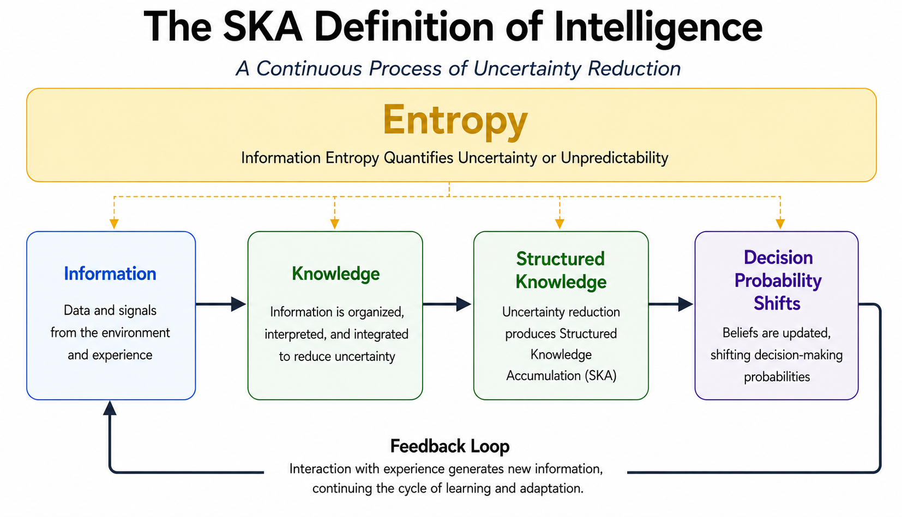

# The Foundation of Artificial Intelligence

## Introduction

The concept of intelligence has been studied for more than a century in psychology, cognitive science, and artificial intelligence, yet no universally accepted definition exists. In this work, we introduce a foundational definition of intelligence grounded in information entropy and Structured Knowledge Accumulation (SKA), from which we derive the Principle of Artificial Intelligence.

## Mainstream Human Intelligence

Mainstream theories of human intelligence generally define intelligence through cognitive capacities such as learning, reasoning, adaptation, abstract thinking, problem solving, and the ability to achieve goals across different environments. These definitions primarily describe intelligence through observable behavior.

## The SKA Definition of Intelligence

From the SKA perspective, intelligence is not a static capability or behavioral attribute but a continuous self-organizing process: uncertainty reduction through information entropy, producing Structured Knowledge Accumulation (SKA) that shifts decision-making probabilities. Through interaction with experience, decision-making progressively becomes more coherent and adaptive.

## An Illustration: Solving a Puzzle

A jigsaw puzzle illustrates the SKA definition in a setting where classical machine learning vocabulary does not apply. There is no loss function, no training set, no optimizer, and no external gradient — yet the solver unmistakably learns the puzzle. At the start, every piece could go anywhere; uncertainty is at its maximum. As pieces lock in, structured knowledge accumulates, not as stored data but as constraints that reduce uncertainty over every remaining placement. Corners and edges go first because each carries the largest reduction in entropy. The center fills in last because by then its uncertainty has already been reduced by what surrounds it. The solver does not optimize an externally specified objective; the dynamics emerge from the system's own information state. The puzzle is solved through self-organized uncertainty reduction — the SKA principle in plain view.

## The SKA Definition of Artificial Intelligence

Artificial intelligence is the SKA principle realized in a computational substrate. The abstract terms from the prior section — *information*, *knowledge*, *structured knowledge*, and *decision probabilities* — acquire precise mathematical counterparts in a neural system, while the principle itself remains unchanged: a system is artificially intelligent to the extent that it self-organizes uncertainty reduction through information entropy, producing structured knowledge that shifts decision probabilities.

Within the SKA framework, these terms are defined as follows:

- **Information entropy** is redefined as a dynamic, layer-wise measure of knowledge alignment in a neural network. For a layer $l$, it is given by

$$
H^{(l)} = -\frac{1}{\ln 2} \sum_{k} \mathbf{z}^{(l)}_{k} \cdot \Delta \mathbf{D}^{(l)}_{k},
$$

where $`\mathbf{z}^{(l)}_{k}`$ is the knowledge vector and $`\Delta \mathbf{D}^{(l)}_{k}`$ is the shift in decision probabilities at step $`k`$. Unlike the static Shannon form, this entropy evolves continuously as knowledge accumulates, providing the local signal that drives forward-only, self-organized uncertainty reduction.

- **Knowledge** ($\mathbf{z}$) refers to the pre-activation values in each neuron that serve as inputs to the sigmoid function, represented as a tensor $\mathbf{Z}$ or as vectors $\mathbf{z}^{(l)}$ for each layer $l$. Knowledge accumulates over forward passes and directly influences decision probabilities through the sigmoid transformation.

- **Structured knowledge** describes knowledge $\mathbf{z}$ that has aligned with decision-probability shifts $\Delta \mathbf{D}$ in a way that minimizes layer-wise entropy. It is characterized by specific relationships between knowledge vectors and entropy gradients, and becomes identifiable when the Tensor Net function crosses zero, indicating $\int \mathbf{D}^{(l)}\, dz = \mathbf{H}^{(l)}$.

- **Structured Knowledge Accumulation** is the process by which knowledge progressively increases in a structured manner, producing decision probabilities that better discriminate between classes. The process follows time-invariant trajectories with characteristic timescales and proceeds through forward-only learning, without requiring backpropagation.

These definitions specify the computational realization of the principle. They do not redefine intelligence — they show what intelligence *looks like* when the substrate is a neural network rather than a brain. The same principle that solves a jigsaw puzzle through self-organized uncertainty reduction also drives a SKA neural network to accumulate structured knowledge through forward-only entropy minimization. The puzzle solver and the network instantiate the same law in different substrates.

## Riemannian Neural Fields

The same mathematical formulation extends naturally from layered neural networks to continuous spatial fields. Where the discrete SKA framework indexes quantities by layer $l$ and step $k$, the Riemannian extension indexes them by position $\mathbf{r}$ on an information manifold and time $t$. The principle is unchanged; only the substrate becomes continuous.

Knowledge becomes a tensor field $\mathbf{Z}(\mathbf{r}, t)$ defined at every point of the manifold, with decision probabilities $\mathbf{D}(\mathbf{r}, t) = \sigma(\mathbf{Z}(\mathbf{r}, t))$ following from the same sigmoid transformation. The layer-wise entropy

$$H^{(l)} = -\frac{1}{\ln 2} \sum_{k} \mathbf{z}^{(l)}_{k} \cdot \Delta \mathbf{D}^{(l)}_{k}$$

becomes a local entropy density

$$h(\mathbf{r}) = -\frac{1}{\ln 2}\, \mathbf{z}(\mathbf{r}) \cdot d\mathbf{D}(\mathbf{r}),$$

defined at every spatial point. The discrete sum over layer index $k$ is replaced by an integral over the manifold, but the form of the expression — knowledge aligned with decision-probability shifts under the same $-1/\ln 2$ factor — is preserved exactly. Forward-only updates, characteristic timescales, and the Tensor Net criterion all carry over without modification.

What is new in the continuous formulation is the geometry. The manifold carries a Riemannian metric

$$g_{ij}(\mathbf{r}) = \alpha\, (\nabla h)_i (\nabla h)_j + \beta\, (\nabla \rho)_i (\nabla \rho)_j + \gamma\, \delta_{ij},$$

built from gradients of the entropy field $h$ and the neuron-density field $\rho$. Knowledge then propagates along geodesics of this metric — paths that minimize information distance — and the network's connectivity emerges from the entropy and density landscape rather than being specified in advance. Architecture is no longer a design choice; it self-organizes from the same principle that drives learning.

A further property of the continuous formulation is that the manifold's dimension is not fixed at three. Because the entropy expression depends only on the alignment of knowledge with decision-probability shifts, it is independent of the ambient dimension; the same formulation holds for $D = 3, 4, 5$ and beyond. Higher-dimensional manifolds give geodesics more directions in which to evolve, expanding the space of information-optimal pathways the system can discover. Architecture discovery thus scales with dimensionality: in higher dimensions, the self-organizing process has access to richer connectivity patterns without any change to the underlying mathematics.

This extension demonstrates that the SKA principle is not tied to a layered architecture or to a particular spatial dimensionality. The discrete neural network is one realization of the principle; the Riemannian neural field, in any ambient dimension, is another, at higher generality. Both instantiate uncertainty reduction through information entropy, producing structured knowledge that shifts decision probabilities. The continuity of the mathematical formulation across these realizations — same entropy expression, same sigmoid transformation, same forward-only dynamics — confirms that the principle is substrate-independent, and that what changes from one realization to the next is only the geometry on which the dynamics unfold.